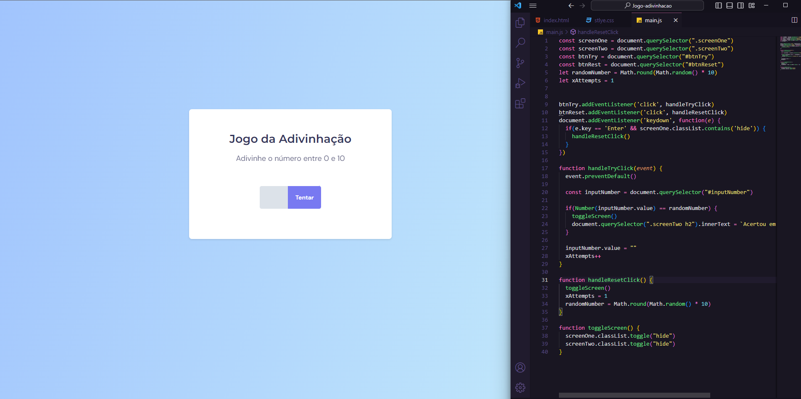

<h1 align="center"> Jogo Adivinhação 🔢 </h1>

 

  

## 🖥️ Tecnologias

Esse projeto foi desenvolvido com as seguintes tecnologias:

- HTML e CSS
- javaScript
- Git e Github

## 📂 Projeto

  Projeto foi recriado uma aplicação a partir de um layout pronto no figma, para fortalecer alguns conceitos aprendidos entre eles:

      <li>Projeto em HTML e CSS.</li>
      <li>Posicionamentos e alinhamentos de elementos. </li>
      <li>Fontes customizadas.</li>
      <li>Espaçamentos.</li>
      <li>Unidade de medida flexível.</li>
      <li>Variáveis.</li>
      <li>Funções *callback*</li>
      <li>Biblioteca JS Math()</li>
      <li>Funções no Javascript</li>
      <li>Manipulação da DOM</li>
      <li>Arrays</li>
  </ul>

 

## 🔖 Layout

Você pode visualizar o layout do projeto através [DESSE LINK](https://www.figma.com/file/X1N3tcCCMPb64pAqUypKjD/Jogo-Adivinha%C3%A7%C3%A3o-(Copy)?node-id=5%3A114&t=lftvFW3RCe9DRVHa-0). É necessário ter conta no [Figma](https://figma.com) para acessá-lo. 

  

## 📧 Contato

E-mail: victorvbprogramador@gmail.com

Linkedin: https://www.linkedin.com/in/victor-vinicius-9b0765263/

